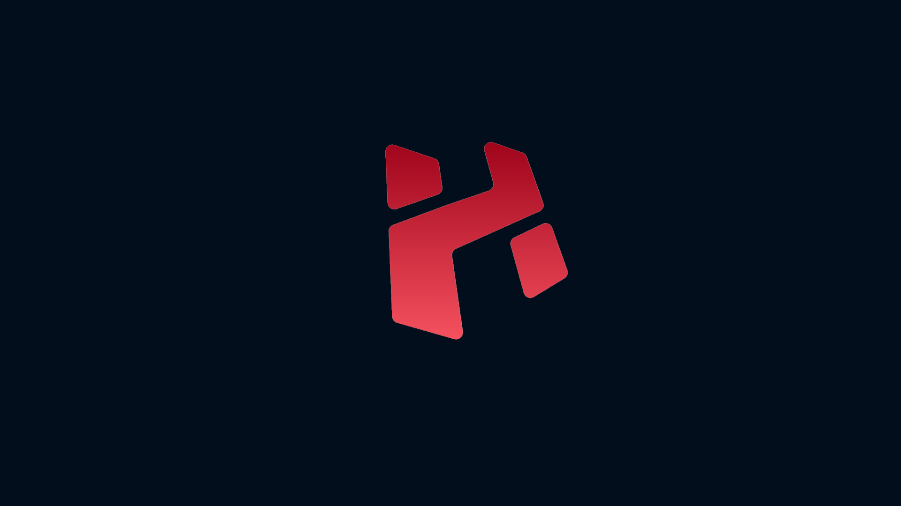

# Menú del Tema

## Tabla de Contenidos

- [Menú](#menú-del-tema)
  - [Tabla de Contenidos](#tabla-de-contenidos)
  - [Tema](#tema)
  - [Características](#características)
  - [Información](#información)
  - [Imágenes](#imágenes)
  - [Documentación](#documentación)

## Tema

Este proyecto presenta un tema profesional y moderno diseñado para mejorar la experiencia visual y funcional en entornos de escritorio y desarrollo. El tema está cuidadosamente elaborado para ofrecer una interfaz atractiva, intuitiva y eficiente.

## Características

- Diseño limpio y minimalista que facilita la concentración y productividad.
- Compatibilidad con múltiples entornos y configuraciones.
- Personalización sencilla mediante archivos de configuración.
- Integración con herramientas comunes de desarrollo y administración.
- Soporte para scripts y automatizaciones que optimizan el flujo de trabajo.

## Información

El tema está orientado a usuarios avanzados que buscan un entorno de trabajo optimizado y estéticamente agradable. 
Incluye configuraciones para gestores de ventanas, terminales y otros componentes esenciales.

## Imágenes

A continuación se muestran algunas capturas de pantalla y ejemplos visuales del tema en acción:

## Documentación
Este proyecto presenta un tema profesional y moderno diseñado para mejorar la experiencia visual y funcional en entornos 
de escritorio y desarrollo. El tema está cuidadosamente elaborado para ofrecer una interfaz atractiva, intuitiva y eficiente.
